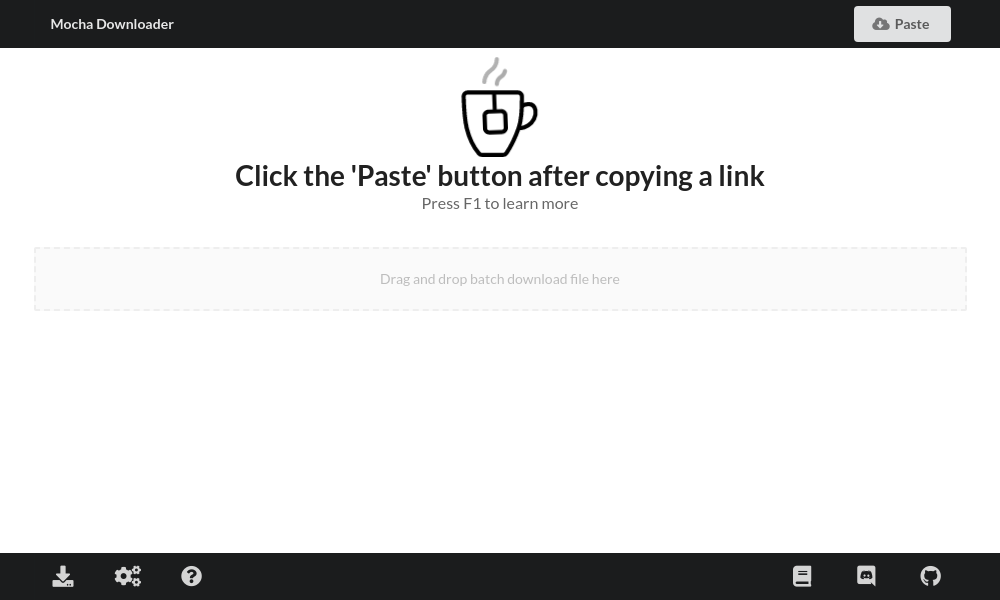

# Design

This document aims to explain the design choices and philosophy of the mocha downloader.
The goal of this is to help contributors align their effort to be more inlined with our philosophy.

## Core values

### Guiding the users

- There shouldn't be a need for the users to "learn" how to use the app.
- At no point of using the app should the users should feel lost.
- Users must be guided from the moment they launch the app all the way through the end when they close it.
- There should be a sense "flow" when using the app.
- The direction must not be explicit and should be implied by the design as naturally as possible.

### Minimalism

- All components must be functional and serve a purpose.
- Do not visually overwhelm the users.

TIP:

- Spacing and sizing should be given extra attention as they are the ones providing hierarchy and structure.

## Design choices

### no CLI

Mocha Downloader is not meant to be automated. CLI is not in our scope.
Even if a pull request is made and someone is there to maintain it, it will not be accepted.

### use of UI framework

We use [semantic-ui](https://github.com/Semantic-Org) as out UI framework.

- Lowers the entry barrier for less experienced designers.
- Makes the design more consistent.

Concern:

- The development of semantic UI seemed to stop at 2018 and this might cause some problem few years down the line.

### use of [styled-components](https://github.com/styled-components)

- To include styles within the react component files and eliminate the need to manage css files.

## Tips

### do not optimize page size

When deploying sites to the web, minimizing the size of the page is very important. However, since the page load time is not bottlenecked by the user's internet connection, there's no need to spend too much time optimizing for size.

## UX

For a component-specific documentation, open the [components](./src/renderer/components) and read the comments. This document is here to explain how all those components work together to create the optimal user experience.

### First impression

- Default window size: 1000x600 (close to golden ratio)
- ideal reading pattern: Headers (Paste link to... & Press F1...) first then Z pattern.
